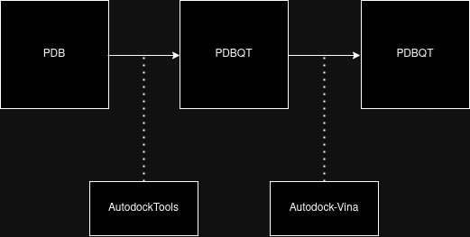

# Docking Automation Project

## Overview

This project automates the process of molecular docking using AutoDock and Vina.
It includes scripts to convert PDB files to PDBQT format and to perform docking for receptor-ligand pairs.
The project aims to streamline the docking process, making it easier to handle multiple receptor-ligand pairs.
No documentation is available for now, but the scripts are commented for ease of understanding.
please feel free to reach out to me if you have any questions or need help with the scripts.
It is still in it's initial stages and is being developed further.



## Prerequisites

Before you begin, ensure you have met the following requirements:

- **Operating System**: Linux (the scripts are tailored for Linux systems for now, this will be updated in the future)
- **Python**: Python 2.7 (required for some MGLTools scripts)

## Modified MGLTools Scripts

The MGLTools scripts included in this project are modified versions of the original scripts to work as required.
Specifically, the following scripts have been modified:
- `mgltools_x86_64Linux2_1.5.7/MGLToolsPckgs/AutoDockTools/GridParameters.py`
- `mgltools_x86_64Linux2_1.5.7/MGLToolsPckgs/AutoDockTools/Utilities24/prepare_ligand4.py`

## Usage

### 1. Convert PDB to PDBQT

The `convert_pdb_to_pdbqt.py` script converts PDB files to PDBQT format, which is required for docking.

1. Place your PDB files in the `./pdb_files` directory.
2. Run the script:
   ```bash
   python2 convert_pdb_to_pdbqt.py
   ```
3. The converted PDBQT files will be saved in the `./pdbqt_files` directory.

### 2. Automate Docking

The `automate_docking.py` script performs docking for each receptor-ligand pair using AutoDock and Vina.

1. Place your PDBQT files in the `./pdbqt_files` directory.
2. Ensure the paths to the required scripts and executables are correctly set in the script.
3. Run the script:
   ```bash
   python2 automate_docking.py
   ```
4. The docking results will be saved in the specified output directories.

## Template and Configuration Files

### Template Files

The template files (`template.gpf` and `template.dpf`) are used to generate the grid parameter file (GPF)
and docking parameter file (DPF) for AutoDock.
The configuration file (`configuration_vina.txt`) is used to set the parameters for Vina docking.
These templates contain default settings that can be customized for each docking run.
Please see the AutoDock documentation for more information on the parameters.

## Notes

- The scripts proposed are a work in progress and may require further modifications, you're welcome to adapt them to your needs.
- The scripts assume specific naming conventions for receptor and ligand files (`_receptor` and `_ligand`).
- Modify the paths in the scripts to match your system configuration.
- The `automate_docking.py` script includes options to run AutoDock and Vina. Set `run_autodock` to `True` if you want to run AutoDock.
- If you already have PDBQT files, you can skip the conversion step and directly use the `automate_docking.py` script.
